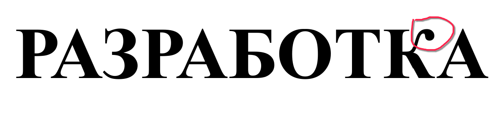

# Шаблон дипломного проекта на XeLaTeX

## Требования для работы

Для работы данного проекта требуются

* Установленный `biber` для сносок
* Установленный `xelatex`

Опционально:

* `git` для скачивания проекта и обновления СТП 

Проверка что всё установлено корректно:

```bash
xelatex --version
```

```bash
biber --version
```

```bash
xdvipdfmx --version
```

## Доп требования для ОС Linux

Если вы пишете дипломный проект на ОС Linux то у вас не будет нужного шрифта Times New Roman от Microsoft (Linux по дефолту заменяет его на очень похожий OSS аналог).

Для того чтобы это исправить и не пришлось перепечатывать весь диплом нужно поставить пакет содержащий `True Type Microsoft Fonts` для вашего дистрибутива. 

#### Команды для установки шрифта в некоторых дистрибутивах

* Ubuntu
    ```bash
    sudo apt install ttf-mscorefonts-installer 
    ```

* Arch
    ```bash
    yay ttf-ms-win11-auto
    ```

* OpenSUSE

    https://software.opensuse.org/package/msttcore-fonts

#### Проверка что шрифты работают

> Буква К должна иметь "крючок" а не плоскую линию как это сделано в OSS версии

## Среда разработки

Данный проект сконфигурирован для работы с vscode, так же можно использовать любую другую среду разработки Texmaker, TeXstudio (да хоть `nano` и `./build.sh`).
## Скачивание проекта

Поскольку данный проект использует гит-сабмодуль СТП проект необходимо скачивать с помощью команды

```bash
git clone --recurse-submodules https://github.com/FileBin/xelatex-bsuir-std-example-diploma
```

Проект должен находится в папке *xelatex-bsuir-std-example-diploma*

## Компиляция PDF из командной строки

В ОС **Linux**

```bash
chmod +x build.sh
./build.sh
```

В ОС **windows** для сборки в командной строке рекомендуется использовать git bash или mingw оболочку
